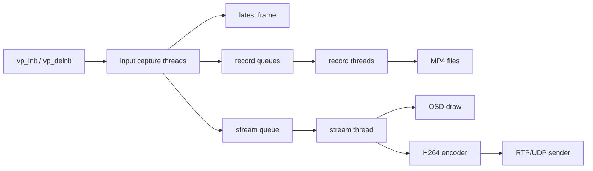

# video_pipeline 模块拆分说明

## 1. 原始文件职责

原来的 `src/video/video_pipeline.c` 把多路视频管线的全部实现放在一个文件里，主要包含：

- HDMI / CSI / USB 输入打开、读取、关闭和采集线程。
- 推流队列、录像队列和丢帧策略。
- H.264 硬编码器打开逻辑。
- 单路/全部通道 MP4 录像线程。
- 快照 JPEG 输出。
- 推流 OSD 十字准星绘制。
- RTP/H264 over UDP 封包发送。
- 推流线程、切换源、强制 IDR。
- `vp_init` / `vp_deinit` / 状态查询等对外 API。

这个文件约 36KB，后续维护时容易出现两个问题：一个是改录像时容易碰到推流逻辑，另一个是新增协议或新增 OSD 时文件会继续膨胀。

## 2. 拆分后的文件

拆分后公共头文件仍然是 `include/video/video_pipeline.h`，外部调用方式不变。内部共享结构放到 `src/video/video_pipeline_internal.h`。

| 文件 | 负责内容 |
| --- | --- |
| `src/video/video_pipeline.c` | 对外主入口：`vp_init`、`vp_deinit`、快照、统计、通道名称 |
| `src/video/video_pipeline_internal.h` | 内部结构体、宏、模块间函数声明 |
| `src/video/video_pipeline_queue.c` | `AVFrame` 环形队列：push、pop、clear、free |
| `src/video/video_pipeline_input.c` | 输入源分发和采集线程：USB / CSI0 / CSI1 / HDMI |
| `src/video/video_pipeline_encode.c` | H.264 编码器公共打开逻辑：优先 `h264_rkmpp`，回退 `h264_v4l2m2m` |
| `src/video/video_pipeline_record.c` | MP4 录像：开始、停止、全部通道同步录像、录像线程、写 trailer |
| `src/video/video_pipeline_osd.c` | 推流画面 OSD：十字准星开关、位置更新和绘制 |
| `src/video/video_pipeline_rtp.c` | UDP socket、RTP header、H264 NAL / FU-A 分片发送 |
| `src/video/video_pipeline_stream.c` | 推流线程、编码、OSD 叠加、切源、强制 IDR |
| `src/video/video_pipeline_util.c` | 存储目录创建、自动文件名生成 |

## 3. 模块关系



## 4. 行为保持

- 外部 API 不变，调用方仍然 include `video/video_pipeline.h`。
- 采集线程仍然是每个已打开通道一个线程。
- 录像线程仍然只在 `vp_record_start` 后创建，`vp_record_stop` 返回时 MP4 文件已经写完 trailer。
- 推流线程仍然常驻，切换通道时清空旧队列并强制下一帧为 I 帧。
- OSD 仍然只画在推流帧上，不影响录像文件。
- RTP/UDP 仍然按 H264 Annex-B 码流解析 NAL，并对大 NAL 做 FU-A 分片。

## 5. 构建改动

`CMakeLists.txt` 中 `rk3588_video_pipeline_main` 已新增拆分后的源文件：

- `src/video/video_pipeline_encode.c`
- `src/video/video_pipeline_input.c`
- `src/video/video_pipeline_osd.c`
- `src/video/video_pipeline_queue.c`
- `src/video/video_pipeline_record.c`
- `src/video/video_pipeline_rtp.c`
- `src/video/video_pipeline_rtsp.c`
- `src/video/video_pipeline_stream.c`
- `src/video/video_pipeline_util.c`

## 6. 后续扩展建议

- 如果后续要加 RTSP / RTMP / WebRTC，可优先从 `video_pipeline_rtp.c` 拆出通用推流接口。
- 如果 OSD 要支持文字、测距数值、图标，建议继续扩展 `video_pipeline_osd.c`，不要放回主入口文件。
- 如果其它可执行程序也要直接使用 `video_pipeline`，需要把同一组 `src/video/video_pipeline_*.c` 加到对应 target。

## 7. 输入配置位置

`src/video/video_pipeline_main.c` 使用和 `src/main.c` 类似的结构体初始化方式。默认输入配置集中在 `g_pipeline_default_channels`，当前三路配置为：

- `usb1`：`/dev/video41`，`mjpeg`，`1280x720@30`。
- `usb2`：`/dev/video43`，`mjpeg`，`640x480@30`。当前两路摄像头共用一个 480M USB 2.0 Hub，该参数已验证可以与 `usb1` 同时采集。
- `hdmi`：`/dev/video40`，由 HDMI-IN 驱动自动识别格式和分辨率；驱动可以输入 60fps，管线按配置限为 30fps 后再送录像和推流。

如果两路 USB 都需要 `1280x720@30`，需要把其中一个摄像头移动到不同的 USB 根控制器，并用 `lsusb -t` 确认两个摄像头不在同一个 480M Hub 下。更换普通外接 Hub 但仍连接同一个上游控制器，不会增加总带宽。

HDMI 模块在打开 FFmpeg/V4L2 采集前会调用 `VIDIOC_QUERY_DV_TIMINGS` 检查输入链路。没有 HDMI 信号时，该通道直接标记为不可用，不再以驱动残留的 `640x480` 默认格式启动，也不会持续输出 `VIDIOC_DQBUF` 错误。插入 HDMI 信号后需要重启管线程序，使通道重新初始化。

两路 USB 共用 `src/input/input_usb.c`。当输入编码为 MJPEG 时，代码严格选择 FFmpeg 的 `mjpeg_rkmpp` 解码器，使用 RK3588 MPP 硬件解码；如果板端 FFmpeg 没有该解码器，对应 USB 通道会打开失败，不会自动退回软件 MJPEG 解码。硬件帧在需要时通过 `av_hwframe_transfer_data` 转成后续录像、抓拍和推流模块可处理的普通帧。

启动后的通道命令名称就是配置中的 `name`：`usb1`、`usb2`、`hdmi`。例如：

```text
switch usb1
switch usb2
switch hdmi
record usb1 /tmp/usb1.mp4
record usb2 /tmp/usb2.mp4
snap hdmi /tmp/hdmi.jpg
```

后续修改输入设备、格式、分辨率、帧率，只需要先看这个结构体，不需要再到函数内部一行一行查找。

## 8. RTSP 推流

现在推流输出支持两种模式：

- `VP_STREAM_OUTPUT_RTP`：原来的裸 RTP/UDP，仍然走 `video_pipeline_rtp.c`。
- `VP_STREAM_OUTPUT_RTSP`：新增 RTSP 发布模式，走 `video_pipeline_rtsp.c`，把已经编码好的 H264 packet 推给 MediaMTX。

RTSP 模式只替换推流输出部分，采集、RGA 缩放、OSD、H264 编码线程都保持原来的流程。

测试工具用法：

```bash
./rk3588_video_pipeline_main
```

电脑端播放：

```bash
ffplay -fflags nobuffer -flags low_delay -framedrop -rtsp_transport udp rtsp://192.168.31.14:8554/live
```

## 9. 输入参数日志、文件级日志与 CMake 源文件收集

V4L2 输入成功打开并找到视频流后，统一调用 `ffmpeg_input_log_stream()`。该函数内部临时把 FFmpeg 全局日志等级提升到 `AV_LOG_INFO`，再调用 FFmpeg 官方的 `av_dump_format()`，直接输出原生的 `Input #0`、设备路径、codec、像素格式、分辨率、fps、tbr 和 tbn，不手工拼接替代文本。

每个使用日志的 `.c` 文件在顶部独立配置日志等级和显示文件名：

```c
#define LOG_LOCAL_LEVEL LOG_LEVEL_DEBUG
#define LOG_FILE_NAME "input_usb.c"
```

可用等级为 `LOG_LEVEL_TRACE`、`LOG_LEVEL_DEBUG`、`LOG_LEVEL_INFO`、`LOG_LEVEL_WARN` 和 `LOG_LEVEL_ERROR`。CMake 不再设置统一的 `LOG_BUILD_LEVEL`，修改某个模块的日志等级只需要编辑对应源文件。

CMake 使用 `file(GLOB ... CONFIGURE_DEPENDS)` 自动收集 `src/common/*.c`、`src/input/*.c` 和 `src/video/*.c`。`video_pipeline_main.c` 从视频模块集合中移除后作为程序入口单独添加。`src/tools/*.c` 不能整体通配加入同一个 target，因为每个工具通常都有自己的 `main()`，必须分别作为各自可执行程序的入口。

RGA转换层支持把FFmpeg的`AV_PIX_FMT_BGR24`映射为`RK_FORMAT_BGR_888`。因此HDMI-IN输出BGR3/BGR24时，可以优先使用RGA完成`BGR24 -> NV12`以及必要的分辨率缩放。首次成功使用RGA时会打印`encode convert path=RGA`；RGA不支持具体帧布局或运行失败时，自动回退`libswscale`并打印`encode convert path=swscale`。

librga 2.1.0存在两个成功返回值：`IM_STATUS_SUCCESS`和`IM_STATUS_NOERROR`。转换层同时接受这两个值，避免把`imresize()`已经成功执行的结果误判为失败并重复回退到软件转换。
